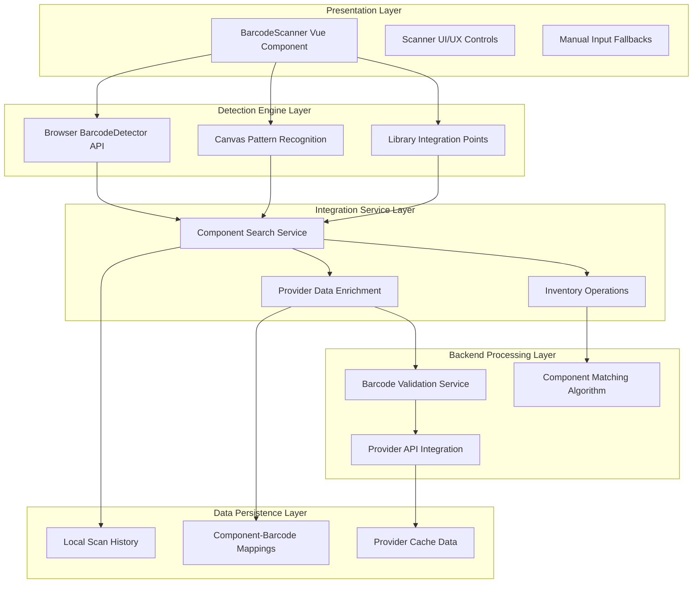
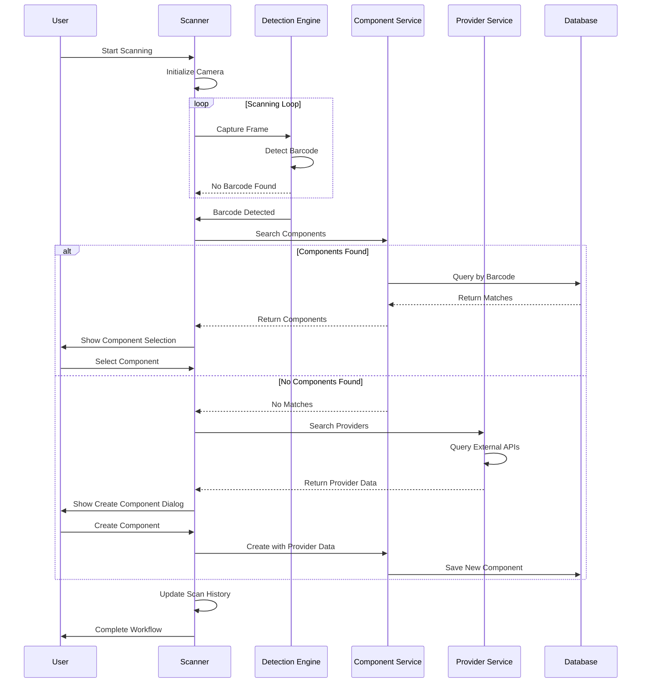

# Barcode Scanning Architecture

**PartsHub Electronic Components Inventory Management System**

---

## Table of Contents

1. [Executive Summary](#executive-summary)
2. [System Architecture](#system-architecture)
3. [Frontend Component Design](#frontend-component-design)
4. [Detection Technology Stack](#detection-technology-stack)
5. [Backend Service Architecture](#backend-service-architecture)
6. [Data Flow & Integration](#data-flow--integration)
7. [User Experience Design](#user-experience-design)
8. [Performance Optimizations](#performance-optimizations)
9. [Security & Privacy](#security--privacy)
10. [Accessibility Features](#accessibility-features)
11. [Future Enhancements](#future-enhancements)
12. [Implementation Guidelines](#implementation-guidelines)

---

## Executive Summary

The PartsHub barcode scanning system provides seamless integration between physical component identification and digital inventory management. Built on a **multi-layered architecture**, it combines modern browser APIs with robust fallback mechanisms to deliver reliable barcode scanning capabilities across diverse devices and environments.

### Key Benefits

- **Universal Compatibility**: Progressive enhancement from native APIs to library fallbacks to manual input
- **Real-time Integration**: Instant component lookup and inventory updates from scanned barcodes
- **Provider Enrichment**: Automatic component data enhancement from LCSC, Octopart, and other providers
- **Accessibility First**: Full screen reader support and keyboard navigation
- **Privacy Focused**: Local-first data handling with user-controlled history retention

### Technology Stack

- **Frontend**: Vue.js 3 + TypeScript + Quasar Framework
- **Detection**: Browser BarcodeDetector API + Canvas fallbacks
- **Backend**: Python FastAPI + SQLAlchemy (future integration)
- **Storage**: Local storage + server sync capabilities

---

## System Architecture

The barcode scanning system follows a **layered architecture** that ensures reliability, maintainability, and extensibility:



### Layer Responsibilities

#### **Presentation Layer**
- User interface and interaction handling
- Camera feed display and scanner overlays
- Error messaging and user guidance
- Accessibility features and keyboard navigation

#### **Detection Engine Layer**
- Barcode pattern recognition and validation
- Multiple detection strategy coordination
- Performance optimization and throttling
- Cross-browser compatibility handling

#### **Integration Service Layer**
- Component database search and matching
- Provider API coordination and enrichment
- Inventory transaction processing
- Search result ranking and deduplication

#### **Backend Processing Layer**
- Barcode format validation and parsing
- Advanced matching algorithms
- Provider data synchronization
- Caching and performance optimization

#### **Data Persistence Layer**
- User scan history management
- Component-barcode relationship mapping
- Provider data caching and refresh
- Cross-device synchronization

---

## Frontend Component Design

### Core Component Architecture

The `BarcodeScanner.vue` component implements a **reactive, event-driven architecture** using Vue 3's Composition API:

```typescript
interface BarcodeScannerProps {
  searchComponents?: boolean    // Enable automatic component lookup
  autoStart?: boolean          // Start scanning immediately
  historyEnabled?: boolean     // Enable scan history tracking
  manualInputEnabled?: boolean // Allow manual barcode entry
}

interface BarcodeScannerEmits {
  'scan-result': (result: ScanResult) => void
  'component-selected': (component: Component) => void
  'create-component': (barcode: string) => void
  'scan-error': (error: ScanError) => void
}
```

### State Management Architecture

```typescript
interface BarcodeScannerState {
  // Core scanning state
  cameraActive: Ref<boolean>
  isScanning: Ref<boolean>
  scanResult: Ref<ScanResult | null>

  // User interface state
  showScanner: Ref<boolean>
  showManualInput: Ref<boolean>
  showSearchResults: Ref<boolean>

  // Data management
  scanHistory: Ref<ScanResult[]>
  searchResults: Ref<Component[]>
  searchLoading: Ref<boolean>

  // Error handling
  cameraError: Ref<string | null>
  scanError: Ref<string | null>
}

// Reactive state initialization
const scannerState = reactive({
  cameraActive: false,
  isScanning: false,
  scanResult: null,
  showScanner: false,
  showManualInput: false,
  showSearchResults: false,
  scanHistory: [],
  searchResults: [],
  searchLoading: false,
  cameraError: null,
  scanError: null
})
```

### Component Lifecycle Management

```typescript
class ScannerLifecycle {
  async mounted(): Promise<void> {
    // Load persisted scan history
    await this.loadScanHistory()

    // Initialize detection capabilities
    await this.initializeDetectionEngine()

    // Setup event listeners
    this.setupEventListeners()

    // Auto-start if requested
    if (this.props.autoStart) {
      await this.startScanning()
    }
  }

  async beforeUnmount(): Promise<void> {
    // Cleanup camera resources
    await this.stopCamera()

    // Save scan history
    await this.saveScanHistory()

    // Remove event listeners
    this.removeEventListeners()

    // Clear detection intervals
    this.clearDetectionTimers()
  }
}
```

### Scanner UI Components

#### **Camera Feed Display**
```vue
<template>
  <div class="camera-wrapper" :class="{ active: cameraActive }">
    <video
      ref="videoElement"
      autoplay
      playsinline
      muted
      class="camera-video"
      :style="{ transform: `scale(${cameraZoom})` }"
    />

    <!-- Scanner Overlay -->
    <canvas
      ref="canvasElement"
      class="scanner-overlay"
      :width="canvasWidth"
      :height="canvasHeight"
    />

    <!-- Scanner Frame with Animation -->
    <div class="scanner-frame">
      <div class="scanner-corners">
        <div class="corner top-left" />
        <div class="corner top-right" />
        <div class="corner bottom-left" />
        <div class="corner bottom-right" />
      </div>
      <div
        class="scanner-line"
        :class="{ scanning: isScanning, found: scanResult }"
      />
    </div>

    <!-- Real-time Instructions -->
    <div class="scanner-instructions">
      <transition name="fade" mode="out-in">
        <div v-if="isScanning" key="scanning">
          <q-icon name="qr_code_scanner" size="24px" />
          Scanning for barcode...
        </div>
        <div v-else-if="scanResult" key="found">
          <q-icon name="check_circle" size="24px" color="positive" />
          Barcode detected!
        </div>
        <div v-else key="ready">
          <q-icon name="center_focus_strong" size="24px" />
          Position barcode within the frame
        </div>
      </transition>
    </div>
  </div>
</template>
```

#### **Results Display**
```vue
<template>
  <div class="scan-results" v-if="scanResult">
    <q-banner class="bg-positive text-white">
      <template v-slot:avatar>
        <q-icon name="qr_code_scanner" />
      </template>

      <div class="result-content">
        <div class="text-subtitle1">Barcode Detected!</div>
        <div class="text-body2 text-mono">{{ scanResult.data }}</div>
        <div class="text-caption">
          Format: {{ scanResult.format }} •
          {{ formatTimestamp(scanResult.timestamp) }}
        </div>
      </div>

      <template v-slot:action>
        <q-btn
          flat
          label="Use This"
          @click="handleBarcodeAccepted"
          class="q-mr-sm"
        />
        <q-btn
          flat
          label="Scan Again"
          @click="resetScanner"
        />
      </template>
    </q-banner>
  </div>
</template>
```

---

## Detection Technology Stack

### Primary: Native Browser BarcodeDetector API

The system leverages the modern **BarcodeDetector API** for optimal performance and accuracy:

```typescript
class NativeBarcodeDetector {
  private detector: BarcodeDetector | null = null

  constructor() {
    if ('BarcodeDetector' in window) {
      this.detector = new BarcodeDetector({
        formats: [
          // Linear barcodes
          'code_128',     // Industrial standard
          'code_39',      // Alphanumeric support
          'code_93',      // Compressed format
          'codabar',      // Medical/library systems

          // Product barcodes
          'ean_13',       // Global trade items
          'ean_8',        // Small products
          'upc_a',        // US/Canada products
          'upc_e',        // Compressed UPC

          // 2D barcodes
          'qr_code',      // General purpose
          'data_matrix',  // High-density text
          'pdf417',       // Government documents
          'aztec'         // Transport tickets
        ]
      })
    }
  }

  get isSupported(): boolean {
    return this.detector !== null
  }

  async detect(source: HTMLCanvasElement | HTMLVideoElement): Promise<DetectedBarcode[]> {
    if (!this.detector) {
      throw new Error('BarcodeDetector not supported')
    }

    try {
      return await this.detector.detect(source)
    } catch (error) {
      console.warn('BarcodeDetector failed:', error)
      return []
    }
  }
}
```

### Secondary: Library-based Detection

For browsers without native support, the system integrates with proven barcode libraries:

```typescript
class LibraryBarcodeDetector {
  private quaggaInitialized = false

  async initializeQuagga(): Promise<void> {
    if (this.quaggaInitialized) return

    // Dynamic import to avoid bundle bloat
    const Quagga = await import('quagga')

    await new Promise<void>((resolve, reject) => {
      Quagga.init({
        inputStream: {
          name: "Live",
          type: "LiveStream",
          target: null, // We'll use manual image processing
          constraints: {
            width: 640,
            height: 480,
            facingMode: "environment"
          }
        },
        decoder: {
          readers: [
            "code_128_reader",
            "ean_reader",
            "ean_8_reader",
            "code_39_reader",
            "code_39_vin_reader",
            "codabar_reader",
            "upc_reader",
            "upc_e_reader"
          ]
        }
      }, (err) => {
        if (err) {
          reject(err)
        } else {
          this.quaggaInitialized = true
          resolve()
        }
      })
    })
  }

  async detectWithQuagga(canvas: HTMLCanvasElement): Promise<ScanResult[]> {
    if (!this.quaggaInitialized) {
      await this.initializeQuagga()
    }

    const Quagga = await import('quagga')

    return new Promise((resolve) => {
      Quagga.decodeSingle({
        src: canvas.toDataURL(),
        numOfWorkers: 0,
        inputStream: {
          size: 800
        },
        decoder: {
          readers: ["code_128_reader", "ean_reader", "ean_8_reader"]
        }
      }, (result) => {
        if (result && result.codeResult) {
          resolve([{
            data: result.codeResult.code,
            format: result.codeResult.format,
            timestamp: new Date(),
            confidence: result.codeResult.decodedCodes?.[0]?.confidence || 0
          }])
        } else {
          resolve([])
        }
      })
    })
  }
}
```

### Fallback: Manual Pattern Detection

For maximum compatibility, a basic pattern detection system provides minimal functionality:

```typescript
class ManualPatternDetector {
  async detectBasicPatterns(canvas: HTMLCanvasElement): Promise<ScanResult[]> {
    const ctx = canvas.getContext('2d')
    if (!ctx) return []

    const imageData = ctx.getImageData(0, 0, canvas.width, canvas.height)

    // Basic pattern recognition for QR codes
    const qrPattern = this.detectQRPattern(imageData)
    if (qrPattern) {
      return [{
        data: qrPattern.data,
        format: 'qr_code',
        timestamp: new Date(),
        confidence: qrPattern.confidence
      }]
    }

    // Basic linear barcode detection
    const linearPattern = this.detectLinearPattern(imageData)
    if (linearPattern) {
      return [{
        data: linearPattern.data,
        format: 'unknown',
        timestamp: new Date(),
        confidence: linearPattern.confidence
      }]
    }

    return []
  }

  private detectQRPattern(imageData: ImageData): PatternResult | null {
    // Simplified QR finder pattern detection
    // Look for the characteristic square patterns in corners

    // This is a basic implementation - production would use
    // more sophisticated computer vision algorithms
    return null
  }

  private detectLinearPattern(imageData: ImageData): PatternResult | null {
    // Basic linear barcode detection
    // Look for alternating light/dark patterns

    // Analyze horizontal lines for barcode patterns
    const { data, width, height } = imageData

    // Sample middle horizontal line
    const y = Math.floor(height / 2)
    const line = []

    for (let x = 0; x < width; x++) {
      const index = (y * width + x) * 4
      const gray = (data[index] + data[index + 1] + data[index + 2]) / 3
      line.push(gray > 128 ? 1 : 0) // Binary threshold
    }

    // Look for barcode-like patterns
    const pattern = this.analyzeBinaryPattern(line)

    if (pattern.confidence > 0.3) {
      return {
        data: pattern.data,
        confidence: pattern.confidence
      }
    }

    return null
  }

  private analyzeBinaryPattern(binaryLine: number[]): { data: string, confidence: number } {
    // Simplified pattern analysis
    // Real implementation would decode specific barcode formats

    let transitions = 0
    for (let i = 1; i < binaryLine.length; i++) {
      if (binaryLine[i] !== binaryLine[i-1]) {
        transitions++
      }
    }

    // Barcode-like patterns have many transitions
    const confidence = Math.min(transitions / 100, 1.0)

    return {
      data: `PATTERN_${transitions}_${Date.now()}`,
      confidence
    }
  }
}
```

### Detection Strategy Coordination

```typescript
class DetectionEngine {
  private strategies: BarcodeDetector[] = [
    new NativeBarcodeDetector(),
    new LibraryBarcodeDetector(),
    new ManualPatternDetector()
  ]

  async detect(source: HTMLCanvasElement): Promise<ScanResult[]> {
    for (const strategy of this.strategies) {
      try {
        if (strategy.isSupported) {
          const results = await strategy.detect(source)
          if (results.length > 0) {
            return results.map(result => ({
              ...result,
              detectionMethod: strategy.constructor.name
            }))
          }
        }
      } catch (error) {
        console.warn(`Detection strategy ${strategy.constructor.name} failed:`, error)
        continue
      }
    }

    return []
  }
}
```

---

## Backend Service Architecture

### Barcode Processing Service

```python
from typing import List, Optional, Dict, Any
from dataclasses import dataclass
from enum import Enum

class BarcodeFormat(Enum):
    CODE_128 = "code_128"
    CODE_39 = "code_39"
    EAN_13 = "ean_13"
    EAN_8 = "ean_8"
    UPC_A = "upc_a"
    UPC_E = "upc_e"
    QR_CODE = "qr_code"
    DATA_MATRIX = "data_matrix"
    PDF417 = "pdf417"

@dataclass
class BarcodeInfo:
    raw_data: str
    format: BarcodeFormat
    checksum_valid: bool
    parsed_data: Dict[str, Any]
    confidence: float
    detection_method: str

class BarcodeService:
    def __init__(self, component_service: ComponentService):
        self.component_service = component_service
        self.validators = {
            BarcodeFormat.EAN_13: EAN13Validator(),
            BarcodeFormat.UPC_A: UPCAValidator(),
            BarcodeFormat.CODE_128: Code128Validator()
        }
        self.parsers = {
            BarcodeFormat.EAN_13: EAN13Parser(),
            BarcodeFormat.UPC_A: UPCAParser(),
            BarcodeFormat.CODE_128: Code128Parser()
        }

    def process_barcode(self, raw_barcode: str, format: str, confidence: float = 1.0) -> BarcodeInfo:
        """Validate and parse barcode data"""
        barcode_format = BarcodeFormat(format)
        validator = self.validators.get(barcode_format)
        parser = self.parsers.get(barcode_format)

        return BarcodeInfo(
            raw_data=raw_barcode,
            format=barcode_format,
            checksum_valid=validator.validate(raw_barcode) if validator else True,
            parsed_data=parser.parse(raw_barcode) if parser else {"raw": raw_barcode},
            confidence=confidence,
            detection_method="unknown"
        )

    async def search_components_by_barcode(self, barcode: str) -> List[Component]:
        """Find components matching barcode using multiple search strategies"""
        results = []

        # Strategy 1: Direct barcode field match
        direct_matches = await self.component_service.search_by_barcode(barcode)
        results.extend(direct_matches)

        # Strategy 2: Part number match (manufacturer barcodes often encode part numbers)
        part_number_matches = await self.component_service.search_components(search=barcode)
        results.extend(part_number_matches)

        # Strategy 3: Custom field search (SKU, catalog numbers, etc.)
        custom_field_matches = await self.component_service.search_by_custom_fields({
            "sku": barcode,
            "catalog_number": barcode,
            "manufacturer_part_number": barcode
        })
        results.extend(custom_field_matches)

        # Strategy 4: Provider SKU search
        provider_matches = await self.search_provider_skus(barcode)
        results.extend(provider_matches)

        return self._deduplicate_and_rank_results(results, barcode)

    async def search_provider_skus(self, barcode: str) -> List[Component]:
        """Search provider systems for matching SKUs"""
        provider_service = ProviderService()

        try:
            provider_results = await provider_service.search_by_sku(barcode)

            # Convert provider results to local components if they exist
            local_components = []
            for provider_result in provider_results:
                local_component = await self.component_service.find_by_provider_data(
                    provider_result.provider_name,
                    provider_result.provider_part_id
                )
                if local_component:
                    local_components.append(local_component)

            return local_components
        except Exception as e:
            logger.warning(f"Provider SKU search failed for {barcode}: {e}")
            return []

    def _deduplicate_and_rank_results(self, results: List[Component], barcode: str) -> List[Component]:
        """Remove duplicates and rank results by relevance"""
        # Remove duplicates by component ID
        unique_results = {comp.id: comp for comp in results}
        components = list(unique_results.values())

        # Rank by relevance
        def relevance_score(component: Component) -> float:
            score = 0.0

            # Exact barcode match gets highest score
            if component.barcode == barcode:
                score += 10.0

            # Part number match
            if component.part_number == barcode:
                score += 8.0

            # Custom field matches
            if hasattr(component, 'custom_fields') and component.custom_fields:
                for field_value in component.custom_fields.values():
                    if str(field_value) == barcode:
                        score += 5.0

            # Partial matches
            if barcode.lower() in component.name.lower():
                score += 2.0

            return score

        return sorted(components, key=relevance_score, reverse=True)
```

### Provider Integration Layer

```python
class ProviderBarcodeSearch:
    def __init__(self):
        self.providers = [
            LCSCProvider(),
            OctopartProvider(),
            DigikeyProvider(),
            MouserProvider()
        ]
        self.cache = BarcodeSearchCache()

    async def search_by_barcode(self, barcode: str) -> List[ProviderSearchResult]:
        """Search all providers for barcode matches with caching"""

        # Check cache first
        cached_results = await self.cache.get(barcode)
        if cached_results:
            return cached_results

        # Search all providers concurrently
        search_tasks = [
            self._search_provider_with_timeout(provider, barcode)
            for provider in self.providers
        ]

        results = await asyncio.gather(*search_tasks, return_exceptions=True)

        # Filter successful results and flatten
        valid_results = []
        for result in results:
            if isinstance(result, list):
                valid_results.extend(result)
            elif not isinstance(result, Exception):
                valid_results.append(result)

        # Cache results
        await self.cache.set(barcode, valid_results, ttl=3600)  # 1 hour cache

        return self._merge_and_deduplicate_provider_results(valid_results)

    async def _search_provider_with_timeout(
        self,
        provider: ComponentDataProvider,
        barcode: str
    ) -> List[ProviderSearchResult]:
        """Search single provider with timeout protection"""
        try:
            async with asyncio.timeout(5.0):  # 5 second timeout per provider
                return await provider.search_by_barcode(barcode)
        except asyncio.TimeoutError:
            logger.warning(f"Timeout searching {provider.name} for barcode {barcode}")
            return []
        except Exception as e:
            logger.warning(f"Error searching {provider.name} for barcode {barcode}: {e}")
            return []

    async def enrich_component_from_barcode(
        self,
        barcode: str,
        component: Component
    ) -> Component:
        """Enhance component data using barcode provider lookups"""
        provider_results = await self.search_by_barcode(barcode)

        if provider_results:
            best_match = provider_results[0]  # Highest ranked result

            # Merge provider data with component
            if not component.specifications:
                component.specifications = {}

            component.specifications.update(best_match.specifications or {})

            # Update missing fields
            component.datasheet_url = component.datasheet_url or best_match.datasheet_url
            component.manufacturer = component.manufacturer or best_match.manufacturer
            component.description = component.description or best_match.description

            # Add provider information to custom fields
            if not component.custom_fields:
                component.custom_fields = {}

            component.custom_fields[f"{best_match.provider_name}_sku"] = best_match.provider_part_id
            component.custom_fields[f"{best_match.provider_name}_url"] = best_match.provider_url

        return component

    def _merge_and_deduplicate_provider_results(
        self,
        results: List[ProviderSearchResult]
    ) -> List[ProviderSearchResult]:
        """Merge similar results from different providers"""

        # Group by manufacturer part number
        grouped = {}
        for result in results:
            key = f"{result.manufacturer}:{result.manufacturer_part_number}"
            if key not in grouped:
                grouped[key] = []
            grouped[key].append(result)

        # Select best result from each group
        merged_results = []
        for group in grouped.values():
            # Sort by provider preference and data completeness
            best_result = max(group, key=lambda r: (
                self._provider_priority(r.provider_name),
                len(r.specifications or {}),
                bool(r.datasheet_url),
                r.confidence or 0
            ))
            merged_results.append(best_result)

        return sorted(merged_results, key=lambda r: r.confidence or 0, reverse=True)

    def _provider_priority(self, provider_name: str) -> int:
        """Return priority score for provider (higher = better)"""
        priorities = {
            "lcsc": 10,
            "digikey": 8,
            "mouser": 8,
            "octopart": 6,
            "farnell": 5
        }
        return priorities.get(provider_name.lower(), 0)
```

---

## Data Flow & Integration

### Scan-to-Component Workflow



### Component Search Strategy

```typescript
class ComponentSearchStrategy {
  async searchByBarcode(barcode: string): Promise<ComponentSearchResult> {
    const strategies = [
      { name: 'direct', weight: 10, search: () => this.searchDirectBarcode(barcode) },
      { name: 'partNumber', weight: 8, search: () => this.searchPartNumber(barcode) },
      { name: 'customFields', weight: 6, search: () => this.searchCustomFields(barcode) },
      { name: 'provider', weight: 4, search: () => this.searchProviderSkus(barcode) },
      { name: 'fuzzy', weight: 2, search: () => this.searchFuzzyMatch(barcode) }
    ]

    const results = new Map<string, ComponentMatch>()

    // Execute search strategies in parallel
    const searchPromises = strategies.map(async (strategy) => {
      try {
        const matches = await strategy.search()
        matches.forEach(match => {
          const existing = results.get(match.component.id)
          const score = strategy.weight * match.confidence

          if (!existing || existing.score < score) {
            results.set(match.component.id, {
              component: match.component,
              score: score,
              matchType: strategy.name,
              confidence: match.confidence
            })
          }
        })
      } catch (error) {
        console.warn(`Search strategy ${strategy.name} failed:`, error)
      }
    })

    await Promise.all(searchPromises)

    // Sort by score and return top results
    const sortedResults = Array.from(results.values())
      .sort((a, b) => b.score - a.score)
      .slice(0, 20) // Limit to top 20 results

    return {
      barcode,
      matches: sortedResults,
      searchTime: Date.now(),
      totalStrategies: strategies.length
    }
  }

  private async searchDirectBarcode(barcode: string): Promise<ComponentMatch[]> {
    const response = await api.get(`/api/v1/components/by-barcode/${encodeURIComponent(barcode)}`)
    return response.data.map(component => ({
      component,
      confidence: 1.0,
      matchField: 'barcode'
    }))
  }

  private async searchPartNumber(barcode: string): Promise<ComponentMatch[]> {
    const response = await api.get(`/api/v1/components?part_number=${encodeURIComponent(barcode)}`)
    return response.data.components.map(component => ({
      component,
      confidence: 0.9,
      matchField: 'part_number'
    }))
  }

  private async searchCustomFields(barcode: string): Promise<ComponentMatch[]> {
    const response = await api.get(`/api/v1/components/search-custom-fields`, {
      params: { value: barcode }
    })
    return response.data.map(result => ({
      component: result.component,
      confidence: 0.7,
      matchField: result.field_name
    }))
  }
}
```

### Data Persistence Strategy

```typescript
interface ScanHistoryManager {
  // Local storage for immediate access
  async saveToLocalStorage(scan: ScanResult): Promise<void> {
    const history = await this.loadFromLocalStorage()
    history.unshift(scan)

    // Keep only last 100 scans locally
    const trimmed = history.slice(0, 100)

    localStorage.setItem('partshub_scan_history', JSON.stringify(trimmed))
  }

  async loadFromLocalStorage(): Promise<ScanResult[]> {
    try {
      const stored = localStorage.getItem('partshub_scan_history')
      if (!stored) return []

      const parsed = JSON.parse(stored)
      return parsed.map(item => ({
        ...item,
        timestamp: new Date(item.timestamp)
      }))
    } catch (error) {
      console.warn('Failed to load scan history from localStorage:', error)
      return []
    }
  }

  // Server sync for cross-device history (when authenticated)
  async syncToServer(scans: ScanResult[]): Promise<void> {
    if (!this.authService.isAuthenticated) return

    try {
      await api.post('/api/v1/user/scan-history', {
        scans: scans.slice(0, 50) // Sync last 50 scans
      })
    } catch (error) {
      console.warn('Failed to sync scan history to server:', error)
    }
  }

  async loadFromServer(): Promise<ScanResult[]> {
    if (!this.authService.isAuthenticated) return []

    try {
      const response = await api.get('/api/v1/user/scan-history')
      return response.data.scans.map(scan => ({
        ...scan,
        timestamp: new Date(scan.timestamp)
      }))
    } catch (error) {
      console.warn('Failed to load scan history from server:', error)
      return []
    }
  }

  // Cleanup and maintenance
  async cleanupOldScans(maxAge: number = 30 * 24 * 60 * 60 * 1000): Promise<void> {
    const cutoff = new Date(Date.now() - maxAge)
    const history = await this.loadFromLocalStorage()

    const filtered = history.filter(scan => scan.timestamp > cutoff)

    localStorage.setItem('partshub_scan_history', JSON.stringify(filtered))
  }

  exportHistory(): string {
    const history = this.loadFromLocalStorage()
    return JSON.stringify(history, null, 2)
  }
}
```

---

## User Experience Design

### Progressive Enhancement Strategy

The barcode scanner implements **graceful degradation** to ensure functionality across all devices and browsers:

```typescript
class ScannerCapabilities {
  static detect(): ScannerCapabilityReport {
    return {
      nativeBarcodeAPI: 'BarcodeDetector' in window,
      cameraAccess: navigator.mediaDevices?.getUserMedia !== undefined,
      clipboardAPI: navigator.clipboard?.writeText !== undefined,
      webWorkers: typeof Worker !== 'undefined',
      webAssembly: typeof WebAssembly !== 'undefined',

      // Determine available features based on capabilities
      availableFeatures: this.getAvailableFeatures(),
      recommendedStrategy: this.getRecommendedStrategy()
    }
  }

  private static getAvailableFeatures(): ScannerFeature[] {
    const features: ScannerFeature[] = ['manual-input', 'scan-history']

    if (this.hasCameraAccess()) {
      features.push('camera-scanning')
    }

    if (this.hasNativeBarcodeAPI()) {
      features.push('native-detection')
    } else if (this.canUseLibraryDetection()) {
      features.push('library-detection')
    }

    if (this.hasClipboardAPI()) {
      features.push('clipboard-operations')
    }

    return features
  }

  private static getRecommendedStrategy(): DetectionStrategy {
    if (this.hasNativeBarcodeAPI() && this.hasCameraAccess()) {
      return 'native-camera'
    } else if (this.canUseLibraryDetection() && this.hasCameraAccess()) {
      return 'library-camera'
    } else if (this.hasCameraAccess()) {
      return 'manual-camera'
    } else {
      return 'manual-only'
    }
  }
}
```

### Scanner Interface States

```typescript
enum ScannerState {
  INACTIVE = 'inactive',           // Scanner not started
  INITIALIZING = 'initializing',   // Camera starting up
  READY = 'ready',                 // Ready to scan
  SCANNING = 'scanning',           // Actively detecting
  RESULT_FOUND = 'result_found',   // Barcode detected
  ERROR = 'error',                 // Error state
  MANUAL_INPUT = 'manual_input'    // Manual entry mode
}

interface ScannerStateTransitions {
  [ScannerState.INACTIVE]: [ScannerState.INITIALIZING, ScannerState.MANUAL_INPUT]
  [ScannerState.INITIALIZING]: [ScannerState.READY, ScannerState.ERROR, ScannerState.INACTIVE]
  [ScannerState.READY]: [ScannerState.SCANNING, ScannerState.INACTIVE, ScannerState.MANUAL_INPUT]
  [ScannerState.SCANNING]: [ScannerState.RESULT_FOUND, ScannerState.READY, ScannerState.ERROR]
  [ScannerState.RESULT_FOUND]: [ScannerState.READY, ScannerState.INACTIVE]
  [ScannerState.ERROR]: [ScannerState.INITIALIZING, ScannerState.INACTIVE, ScannerState.MANUAL_INPUT]
  [ScannerState.MANUAL_INPUT]: [ScannerState.READY, ScannerState.INACTIVE]
}
```

### Responsive Design Considerations

```scss
.barcode-scanner {
  // Mobile-first responsive design
  .scanner-container {
    width: 100%;
    max-width: 600px;
    margin: 0 auto;

    @media (max-width: 768px) {
      // Mobile optimizations
      .camera-video {
        height: 60vh;
        object-fit: cover;
      }

      .scanner-frame {
        width: 80%;
        height: 30%;
      }

      .scanner-controls {
        position: fixed;
        bottom: 0;
        left: 0;
        right: 0;
        padding: 1rem;
        background: rgba(0, 0, 0, 0.8);
      }
    }

    @media (min-width: 769px) {
      // Desktop optimizations
      .camera-video {
        height: 400px;
      }

      .scanner-frame {
        width: 300px;
        height: 180px;
      }

      .scanner-controls {
        margin-top: 1rem;
      }
    }
  }

  // High contrast mode support
  @media (prefers-contrast: high) {
    .scanner-frame {
      border-width: 4px;
      border-color: #fff;
    }

    .scanner-corners .corner {
      border-width: 4px;
      border-color: #fff;
    }
  }

  // Reduced motion support
  @media (prefers-reduced-motion: reduce) {
    .scanner-line {
      animation: none;
    }

    .fade-transition {
      transition: none;
    }
  }
}
```

---

## Performance Optimizations

### Memory Management

```typescript
class ScannerOptimizations {
  private static readonly CANVAS_POOL_SIZE = 3
  private static readonly DETECTION_THROTTLE = 100 // ms
  private static readonly MAX_HISTORY_SIZE = 100

  // Canvas recycling to reduce garbage collection
  private canvasPool: HTMLCanvasElement[] = []
  private canvasInUse = new Set<HTMLCanvasElement>()

  acquireCanvas(width: number, height: number): HTMLCanvasElement {
    let canvas = this.canvasPool.pop()

    if (!canvas) {
      canvas = document.createElement('canvas')
    }

    canvas.width = width
    canvas.height = height
    this.canvasInUse.add(canvas)

    return canvas
  }

  releaseCanvas(canvas: HTMLCanvasElement): void {
    if (!this.canvasInUse.has(canvas)) return

    // Clear canvas content
    const ctx = canvas.getContext('2d')
    ctx?.clearRect(0, 0, canvas.width, canvas.height)

    this.canvasInUse.delete(canvas)

    // Return to pool if there's space
    if (this.canvasPool.length < ScannerOptimizations.CANVAS_POOL_SIZE) {
      this.canvasPool.push(canvas)
    }
  }

  // Detection throttling to prevent excessive CPU usage
  private lastDetectionTime = 0

  shouldPerformDetection(): boolean {
    const now = performance.now()
    if (now - this.lastDetectionTime < ScannerOptimizations.DETECTION_THROTTLE) {
      return false
    }
    this.lastDetectionTime = now
    return true
  }

  // Memory-efficient scan history management
  private scanHistory: ScanResult[] = []

  addToHistory(scan: ScanResult): void {
    this.scanHistory.unshift(scan)

    // Trim to maximum size
    if (this.scanHistory.length > ScannerOptimizations.MAX_HISTORY_SIZE) {
      this.scanHistory = this.scanHistory.slice(0, ScannerOptimizations.MAX_HISTORY_SIZE)
    }
  }

  // Cleanup on component destruction
  cleanup(): void {
    // Clear all canvases
    [...this.canvasPool, ...this.canvasInUse].forEach(canvas => {
      const ctx = canvas.getContext('2d')
      ctx?.clearRect(0, 0, canvas.width, canvas.height)
    })

    this.canvasPool = []
    this.canvasInUse.clear()
    this.scanHistory = []
  }
}
```

### Network Optimization

```typescript
class NetworkOptimizations {
  private searchCache = new LRUCache<string, ComponentSearchResult>({
    max: 500,
    ttl: 5 * 60 * 1000 // 5 minutes
  })

  private providerCache = new LRUCache<string, ProviderSearchResult[]>({
    max: 200,
    ttl: 30 * 60 * 1000 // 30 minutes
  })

  // Debounced search to prevent excessive API calls
  private searchDebounce = debounce(async (barcode: string) => {
    return await this.performComponentSearch(barcode)
  }, 300)

  async searchWithCache(barcode: string): Promise<ComponentSearchResult> {
    // Check cache first
    const cached = this.searchCache.get(barcode)
    if (cached) {
      return cached
    }

    // Perform debounced search
    const result = await this.searchDebounce(barcode)

    // Cache result
    this.searchCache.set(barcode, result)

    return result
  }

  // Batch provider searches to reduce API calls
  private pendingProviderSearches = new Map<string, Promise<ProviderSearchResult[]>>()

  async searchProviders(barcode: string): Promise<ProviderSearchResult[]> {
    // Check cache
    const cached = this.providerCache.get(barcode)
    if (cached) {
      return cached
    }

    // Check if search is already in progress
    const existing = this.pendingProviderSearches.get(barcode)
    if (existing) {
      return existing
    }

    // Start new search
    const searchPromise = this.performProviderSearch(barcode)
    this.pendingProviderSearches.set(barcode, searchPromise)

    try {
      const results = await searchPromise
      this.providerCache.set(barcode, results)
      return results
    } finally {
      this.pendingProviderSearches.delete(barcode)
    }
  }

  // Preload likely searches based on scan history
  async preloadLikelySearches(scanHistory: ScanResult[]): Promise<void> {
    const recentBarcodes = scanHistory
      .slice(0, 10)
      .map(scan => scan.data)
      .filter(barcode => !this.searchCache.has(barcode))

    // Preload searches in background
    const preloadPromises = recentBarcodes.map(barcode =>
      this.searchWithCache(barcode).catch(() => {}) // Ignore errors
    )

    // Don't await - run in background
    Promise.all(preloadPromises)
  }
}
```

### Detection Performance

```typescript
class DetectionPerformance {
  private readonly TARGET_FPS = 15
  private readonly MAX_CANVAS_SIZE = 640 * 480

  // Adaptive frame processing based on performance
  private frameProcessingTimes: number[] = []
  private currentInterval = 1000 / this.TARGET_FPS

  recordFrameTime(processingTime: number): void {
    this.frameProcessingTimes.push(processingTime)

    // Keep only last 10 measurements
    if (this.frameProcessingTimes.length > 10) {
      this.frameProcessingTimes.shift()
    }

    this.adjustInterval()
  }

  private adjustInterval(): void {
    if (this.frameProcessingTimes.length < 5) return

    const avgTime = this.frameProcessingTimes.reduce((a, b) => a + b) / this.frameProcessingTimes.length
    const targetTime = 1000 / this.TARGET_FPS

    if (avgTime > targetTime * 1.5) {
      // Processing too slow, increase interval
      this.currentInterval = Math.min(this.currentInterval * 1.2, 2000)
    } else if (avgTime < targetTime * 0.5) {
      // Processing fast, decrease interval
      this.currentInterval = Math.max(this.currentInterval * 0.8, targetTime)
    }
  }

  getCurrentInterval(): number {
    return this.currentInterval
  }

  // Optimize canvas size based on device capabilities
  getOptimalCanvasSize(videoWidth: number, videoHeight: number): { width: number, height: number } {
    const totalPixels = videoWidth * videoHeight

    if (totalPixels <= this.MAX_CANVAS_SIZE) {
      return { width: videoWidth, height: videoHeight }
    }

    // Scale down maintaining aspect ratio
    const scale = Math.sqrt(this.MAX_CANVAS_SIZE / totalPixels)

    return {
      width: Math.floor(videoWidth * scale),
      height: Math.floor(videoHeight * scale)
    }
  }

  // Region of interest optimization
  getRegionOfInterest(canvasWidth: number, canvasHeight: number): ImageDataRegion {
    // Focus detection on center region where users typically position barcodes
    const roiWidth = Math.floor(canvasWidth * 0.8)
    const roiHeight = Math.floor(canvasHeight * 0.6)
    const roiX = Math.floor((canvasWidth - roiWidth) / 2)
    const roiY = Math.floor((canvasHeight - roiHeight) / 2)

    return {
      x: roiX,
      y: roiY,
      width: roiWidth,
      height: roiHeight
    }
  }
}
```

---

## Security & Privacy

### Data Protection Strategies

```typescript
class ScannerSecurity {
  // Input sanitization for all barcode data
  sanitizeBarcodeInput(rawBarcode: string): string {
    // Remove potentially dangerous characters
    const sanitized = rawBarcode
      .replace(/[<>\"'&]/g, '')  // Remove HTML/script injection chars
      .replace(/[^\x20-\x7E]/g, '') // Remove non-printable ASCII
      .trim()
      .substring(0, 200) // Limit length

    if (!/^[A-Za-z0-9\-_\+\.\s]*$/.test(sanitized)) {
      throw new Error('Invalid barcode format detected')
    }

    return sanitized
  }

  // Secure camera permission handling
  async requestCameraPermission(): Promise<CameraPermissionResult> {
    try {
      // Test permission without starting stream
      const testStream = await navigator.mediaDevices.getUserMedia({
        video: { width: 1, height: 1 }
      })
      testStream.getTracks().forEach(track => track.stop())

      return { granted: true, error: null }
    } catch (error: any) {
      return {
        granted: false,
        error: this.handlePermissionError(error)
      }
    }
  }

  private handlePermissionError(error: DOMException): string {
    switch (error.name) {
      case 'NotAllowedError':
        return 'Camera access denied. Please allow camera permission in browser settings.'
      case 'NotFoundError':
        return 'No camera device found. Please connect a camera and try again.'
      case 'NotReadableError':
        return 'Camera is currently in use by another application.'
      case 'OverconstrainedError':
        return 'Camera does not support required settings.'
      default:
        return `Camera error: ${error.message}`
    }
  }

  // Secure local storage with encryption
  async encryptAndStore(key: string, data: any): Promise<void> {
    try {
      const jsonData = JSON.stringify(data)
      const encrypted = await this.encrypt(jsonData)
      localStorage.setItem(`partshub_secure_${key}`, encrypted)
    } catch (error) {
      console.warn('Failed to encrypt and store data:', error)
      // Fallback to unencrypted storage
      localStorage.setItem(`partshub_${key}`, JSON.stringify(data))
    }
  }

  async decryptAndRetrieve(key: string): Promise<any> {
    try {
      // Try encrypted version first
      const encrypted = localStorage.getItem(`partshub_secure_${key}`)
      if (encrypted) {
        const decrypted = await this.decrypt(encrypted)
        return JSON.parse(decrypted)
      }

      // Fallback to unencrypted
      const unencrypted = localStorage.getItem(`partshub_${key}`)
      return unencrypted ? JSON.parse(unencrypted) : null
    } catch (error) {
      console.warn('Failed to decrypt stored data:', error)
      return null
    }
  }

  private async encrypt(data: string): Promise<string> {
    if (!crypto.subtle) {
      throw new Error('Web Crypto API not available')
    }

    const encoder = new TextEncoder()
    const dataBuffer = encoder.encode(data)

    // Generate key from user session
    const keyMaterial = await crypto.subtle.importKey(
      'raw',
      encoder.encode(this.getUserSessionId()),
      { name: 'PBKDF2' },
      false,
      ['deriveKey']
    )

    const key = await crypto.subtle.deriveKey(
      {
        name: 'PBKDF2',
        salt: encoder.encode('partshub-salt'),
        iterations: 100000,
        hash: 'SHA-256'
      },
      keyMaterial,
      { name: 'AES-GCM', length: 256 },
      false,
      ['encrypt']
    )

    const iv = crypto.getRandomValues(new Uint8Array(12))
    const encrypted = await crypto.subtle.encrypt(
      { name: 'AES-GCM', iv },
      key,
      dataBuffer
    )

    // Combine IV and encrypted data
    const combined = new Uint8Array(iv.length + encrypted.byteLength)
    combined.set(iv)
    combined.set(new Uint8Array(encrypted), iv.length)

    return btoa(String.fromCharCode(...combined))
  }

  private async decrypt(encryptedData: string): Promise<string> {
    if (!crypto.subtle) {
      throw new Error('Web Crypto API not available')
    }

    const encoder = new TextEncoder()
    const decoder = new TextDecoder()

    // Decode base64
    const combined = new Uint8Array(
      atob(encryptedData).split('').map(c => c.charCodeAt(0))
    )

    // Extract IV and encrypted data
    const iv = combined.slice(0, 12)
    const encrypted = combined.slice(12)

    // Recreate key
    const keyMaterial = await crypto.subtle.importKey(
      'raw',
      encoder.encode(this.getUserSessionId()),
      { name: 'PBKDF2' },
      false,
      ['deriveKey']
    )

    const key = await crypto.subtle.deriveKey(
      {
        name: 'PBKDF2',
        salt: encoder.encode('partshub-salt'),
        iterations: 100000,
        hash: 'SHA-256'
      },
      keyMaterial,
      { name: 'AES-GCM', length: 256 },
      false,
      ['decrypt']
    )

    const decrypted = await crypto.subtle.decrypt(
      { name: 'AES-GCM', iv },
      key,
      encrypted
    )

    return decoder.decode(decrypted)
  }

  private getUserSessionId(): string {
    // Generate a session-specific identifier
    let sessionId = sessionStorage.getItem('partshub_session_id')
    if (!sessionId) {
      sessionId = crypto.randomUUID()
      sessionStorage.setItem('partshub_session_id', sessionId)
    }
    return sessionId
  }
}
```

### Privacy Controls

```typescript
interface PrivacySettings {
  enableScanHistory: boolean
  enableCloudSync: boolean
  enableProviderSearch: boolean
  enableAnalytics: boolean
  autoDeleteOldScans: boolean
  maxHistoryAge: number // days
}

class PrivacyManager {
  private settings: PrivacySettings

  constructor() {
    this.settings = this.loadPrivacySettings()
  }

  // User-controlled privacy settings
  async updatePrivacySettings(newSettings: Partial<PrivacySettings>): Promise<void> {
    this.settings = { ...this.settings, ...newSettings }

    // Apply settings immediately
    await this.applyPrivacySettings()

    // Save to storage
    localStorage.setItem('partshub_privacy_settings', JSON.stringify(this.settings))
  }

  private async applyPrivacySettings(): Promise<void> {
    // Clear history if disabled
    if (!this.settings.enableScanHistory) {
      await this.clearAllScanHistory()
    }

    // Clear cloud data if sync disabled
    if (!this.settings.enableCloudSync) {
      await this.clearCloudSyncData()
    }

    // Clear provider cache if disabled
    if (!this.settings.enableProviderSearch) {
      await this.clearProviderCache()
    }

    // Setup automatic cleanup
    if (this.settings.autoDeleteOldScans) {
      this.scheduleHistoryCleanup()
    }
  }

  // Data retention management
  async cleanupOldData(): Promise<void> {
    if (!this.settings.autoDeleteOldScans) return

    const cutoffDate = new Date()
    cutoffDate.setDate(cutoffDate.getDate() - this.settings.maxHistoryAge)

    // Clean local history
    const history = await this.loadScanHistory()
    const filtered = history.filter(scan => scan.timestamp > cutoffDate)

    await this.saveScanHistory(filtered)

    // Clean provider cache
    await this.cleanupProviderCache(cutoffDate)
  }

  // Data export for user transparency
  async exportUserData(): Promise<UserDataExport> {
    return {
      scanHistory: this.settings.enableScanHistory ? await this.loadScanHistory() : [],
      privacySettings: this.settings,
      providerCache: this.settings.enableProviderSearch ? await this.exportProviderCache() : [],
      exportDate: new Date(),
      version: '1.0'
    }
  }

  // Complete data deletion
  async deleteAllUserData(): Promise<void> {
    // Clear all local storage
    const keysToRemove = []
    for (let i = 0; i < localStorage.length; i++) {
      const key = localStorage.key(i)
      if (key?.startsWith('partshub_')) {
        keysToRemove.push(key)
      }
    }
    keysToRemove.forEach(key => localStorage.removeItem(key))

    // Clear session storage
    const sessionKeysToRemove = []
    for (let i = 0; i < sessionStorage.length; i++) {
      const key = sessionStorage.key(i)
      if (key?.startsWith('partshub_')) {
        sessionKeysToRemove.push(key)
      }
    }
    sessionKeysToRemove.forEach(key => sessionStorage.removeItem(key))

    // Clear cloud data if user is authenticated
    if (this.authService.isAuthenticated) {
      try {
        await api.delete('/api/v1/user/data')
      } catch (error) {
        console.warn('Failed to delete server data:', error)
      }
    }
  }
}
```

---

## Accessibility Features

### Screen Reader Support

```vue
<template>
  <div
    class="barcode-scanner"
    role="application"
    :aria-label="scannerAriaLabel"
    :aria-describedby="scannerDescriptionId"
  >
    <!-- Screen reader announcements -->
    <div
      :id="scannerDescriptionId"
      class="sr-only"
      aria-live="polite"
      aria-atomic="true"
    >
      {{ currentStatusAnnouncement }}
    </div>

    <!-- Scanner controls with keyboard support -->
    <div class="scanner-controls" role="toolbar" aria-label="Barcode scanner controls">
      <button
        @click="toggleScanning"
        @keydown.space.prevent="toggleScanning"
        @keydown.enter.prevent="toggleScanning"
        :aria-pressed="isScanning"
        :aria-describedby="toggleButtonDescriptionId"
        class="scanner-toggle"
      >
        <q-icon :name="isScanning ? 'stop' : 'qr_code_scanner'" />
        {{ isScanning ? 'Stop Scanner' : 'Start Scanner' }}
      </button>

      <div :id="toggleButtonDescriptionId" class="sr-only">
        {{ isScanning
          ? 'Stop the barcode scanner and return to manual input'
          : 'Start the camera-based barcode scanner'
        }}
      </div>

      <button
        @click="showManualInput = true"
        @keydown.space.prevent="showManualInput = true"
        :aria-expanded="showManualInput"
        aria-controls="manual-input-section"
        class="manual-input-toggle"
      >
        <q-icon name="keyboard" />
        Manual Input
      </button>

      <button
        @click="showHistory = true"
        @keydown.space.prevent="showHistory = true"
        :aria-expanded="showHistory"
        aria-controls="scan-history-section"
        :aria-describedby="historyButtonDescriptionId"
        class="history-toggle"
      >
        <q-icon name="history" />
        Scan History ({{ scanHistory.length }})
      </button>

      <div :id="historyButtonDescriptionId" class="sr-only">
        View {{ scanHistory.length }} previously scanned barcodes
      </div>
    </div>

    <!-- Scanner status with ARIA live region -->
    <div
      class="scanner-status"
      aria-live="polite"
      aria-atomic="false"
    >
      <div v-if="cameraError" role="alert" class="error-message">
        <q-icon name="error" />
        {{ cameraError }}
        <button @click="retryCamera" class="retry-button">
          Retry Camera Access
        </button>
      </div>

      <div v-else-if="isScanning" class="scanning-message">
        <q-icon name="qr_code_scanner" />
        <span class="sr-only">Scanner active. </span>
        Position barcode within camera view
      </div>

      <div v-else-if="scanResult" class="result-message" role="alert">
        <q-icon name="check_circle" color="positive" />
        <span class="sr-only">Barcode detected. </span>
        Found: {{ scanResult.data }}
      </div>
    </div>

    <!-- Manual input section -->
    <section
      v-if="showManualInput"
      id="manual-input-section"
      class="manual-input"
      aria-labelledby="manual-input-heading"
    >
      <h3 id="manual-input-heading" class="section-heading">
        Manual Barcode Entry
      </h3>

      <label for="manual-barcode-input" class="manual-input-label">
        Enter barcode manually:
      </label>
      <input
        id="manual-barcode-input"
        v-model="manualBarcode"
        type="text"
        class="manual-input-field"
        placeholder="Type or paste barcode here"
        @keydown.enter="submitManualBarcode"
        :aria-describedby="manualInputHelpId"
        autocomplete="off"
        spellcheck="false"
      />

      <div :id="manualInputHelpId" class="input-help">
        Enter the barcode text manually, then press Enter or click Submit
      </div>

      <button
        @click="submitManualBarcode"
        :disabled="!manualBarcode.trim()"
        class="submit-manual"
        :aria-describedby="submitButtonHelpId"
      >
        Submit Barcode
      </button>

      <div :id="submitButtonHelpId" class="sr-only">
        Submit the manually entered barcode for processing
      </div>
    </section>

    <!-- Scan history section -->
    <section
      v-if="showHistory"
      id="scan-history-section"
      class="scan-history"
      aria-labelledby="history-heading"
    >
      <h3 id="history-heading" class="section-heading">
        Recent Scans
      </h3>

      <div v-if="scanHistory.length === 0" class="empty-history">
        No scanned barcodes yet
      </div>

      <ul v-else class="history-list" role="list">
        <li
          v-for="(scan, index) in scanHistory.slice(0, 10)"
          :key="index"
          class="history-item"
          role="listitem"
        >
          <button
            @click="selectFromHistory(scan)"
            @keydown.space.prevent="selectFromHistory(scan)"
            class="history-item-button"
            :aria-describedby="`history-item-${index}-details`"
          >
            <div class="history-item-barcode">{{ scan.data }}</div>
            <div
              :id="`history-item-${index}-details`"
              class="history-item-details"
            >
              {{ scan.format }} • {{ formatTimeAgo(scan.timestamp) }}
            </div>
          </button>

          <button
            @click="copyToClipboard(scan.data)"
            @keydown.space.prevent="copyToClipboard(scan.data)"
            :aria-label="`Copy ${scan.data} to clipboard`"
            class="copy-button"
          >
            <q-icon name="content_copy" />
            <span class="sr-only">Copy</span>
          </button>
        </li>
      </ul>
    </section>
  </div>
</template>

<script setup lang="ts">
// Accessibility-focused computed properties
const scannerAriaLabel = computed(() => {
  if (isScanning.value) {
    return 'Barcode scanner active, position barcode in camera view'
  } else if (scanResult.value) {
    return `Barcode detected: ${scanResult.value.data}`
  } else {
    return 'Barcode scanner ready to start'
  }
})

const currentStatusAnnouncement = computed(() => {
  if (cameraError.value) {
    return `Scanner error: ${cameraError.value}`
  } else if (isScanning.value) {
    return 'Scanner started, position barcode in camera view'
  } else if (scanResult.value) {
    return `Barcode detected: ${scanResult.value.data}, format: ${scanResult.value.format}`
  } else {
    return ''
  }
})

// Generate unique IDs for ARIA relationships
const scannerDescriptionId = `scanner-desc-${Math.random().toString(36).substr(2, 9)}`
const toggleButtonDescriptionId = `toggle-desc-${Math.random().toString(36).substr(2, 9)}`
const historyButtonDescriptionId = `history-desc-${Math.random().toString(36).substr(2, 9)}`
const manualInputHelpId = `manual-help-${Math.random().toString(36).substr(2, 9)}`
const submitButtonHelpId = `submit-help-${Math.random().toString(36).substr(2, 9)}`

// Keyboard navigation support
function handleKeyboardNavigation(event: KeyboardEvent): void {
  switch (event.key) {
    case 'Escape':
      if (isScanning.value) {
        stopScanning()
      } else if (showManualInput.value) {
        showManualInput.value = false
      } else if (showHistory.value) {
        showHistory.value = false
      }
      break

    case 'Enter':
    case ' ':
      if (event.target === document.body) {
        event.preventDefault()
        if (!isScanning.value) {
          startScanning()
        }
      }
      break
  }
}

// Voice announcements for screen readers
function announceToScreenReader(message: string): void {
  const announcement = document.createElement('div')
  announcement.setAttribute('aria-live', 'assertive')
  announcement.setAttribute('aria-atomic', 'true')
  announcement.className = 'sr-only'
  announcement.textContent = message

  document.body.appendChild(announcement)

  // Remove after announcement
  setTimeout(() => {
    document.body.removeChild(announcement)
  }, 1000)
}

// Enhanced scan result handling with announcements
function handleScanSuccess(result: ScanResult): void {
  scanResult.value = result

  // Announce to screen reader
  announceToScreenReader(
    `Barcode successfully scanned: ${result.data}, format: ${result.format}`
  )

  // Stop scanning
  stopScanning()

  // Emit result
  emit('scan-result', result)
}

// Keyboard event listeners
onMounted(() => {
  document.addEventListener('keydown', handleKeyboardNavigation)
})

onUnmounted(() => {
  document.removeEventListener('keydown', handleKeyboardNavigation)
})
</script>

<style scoped>
/* Screen reader only content */
.sr-only {
  position: absolute;
  width: 1px;
  height: 1px;
  padding: 0;
  margin: -1px;
  overflow: hidden;
  clip: rect(0, 0, 0, 0);
  white-space: nowrap;
  border: 0;
}

/* High contrast mode support */
@media (prefers-contrast: high) {
  .scanner-frame {
    border-width: 4px;
    border-color: #ffffff;
    background: rgba(0, 0, 0, 0.8);
  }

  .scanner-controls button {
    border: 2px solid #ffffff;
    background: #000000;
    color: #ffffff;
  }

  .scanner-controls button:focus {
    outline: 3px solid #ffffff;
    outline-offset: 2px;
  }
}

/* Reduced motion support */
@media (prefers-reduced-motion: reduce) {
  .scanner-line {
    animation: none;
  }

  .fade-transition,
  .slide-transition {
    transition: none;
  }
}

/* Focus management */
.scanner-controls button:focus,
.manual-input-field:focus,
.history-item-button:focus {
  outline: 2px solid #1976d2;
  outline-offset: 2px;
}

/* Touch targets for mobile accessibility */
@media (max-width: 768px) {
  .scanner-controls button,
  .history-item-button {
    min-height: 44px;
    min-width: 44px;
    padding: 12px 16px;
  }
}
</style>
```

### Keyboard Navigation

```typescript
class KeyboardNavigationManager {
  private focusableElements: HTMLElement[] = []
  private currentFocusIndex = -1

  initializeKeyboardNavigation(container: HTMLElement): void {
    this.updateFocusableElements(container)
    this.attachKeyboardListeners(container)
  }

  private updateFocusableElements(container: HTMLElement): void {
    const selector = [
      'button:not([disabled])',
      'input:not([disabled])',
      'select:not([disabled])',
      'textarea:not([disabled])',
      '[tabindex]:not([tabindex="-1"])',
      'a[href]'
    ].join(', ')

    this.focusableElements = Array.from(container.querySelectorAll(selector))
  }

  private attachKeyboardListeners(container: HTMLElement): void {
    container.addEventListener('keydown', this.handleKeyDown.bind(this))
  }

  private handleKeyDown(event: KeyboardEvent): void {
    switch (event.key) {
      case 'Tab':
        this.handleTabNavigation(event)
        break

      case 'ArrowDown':
      case 'ArrowRight':
        this.navigateNext(event)
        break

      case 'ArrowUp':
      case 'ArrowLeft':
        this.navigatePrevious(event)
        break

      case 'Home':
        this.navigateToFirst(event)
        break

      case 'End':
        this.navigateToLast(event)
        break

      case 'Escape':
        this.handleEscape(event)
        break

      case 'Enter':
      case ' ':
        this.handleActivation(event)
        break
    }
  }

  private handleTabNavigation(event: KeyboardEvent): void {
    // Let browser handle normal tab navigation
    // Update our current focus index
    const target = event.target as HTMLElement
    this.currentFocusIndex = this.focusableElements.indexOf(target)
  }

  private navigateNext(event: KeyboardEvent): void {
    event.preventDefault()

    if (this.focusableElements.length === 0) return

    this.currentFocusIndex = (this.currentFocusIndex + 1) % this.focusableElements.length
    this.focusableElements[this.currentFocusIndex].focus()
  }

  private navigatePrevious(event: KeyboardEvent): void {
    event.preventDefault()

    if (this.focusableElements.length === 0) return

    this.currentFocusIndex = this.currentFocusIndex <= 0
      ? this.focusableElements.length - 1
      : this.currentFocusIndex - 1

    this.focusableElements[this.currentFocusIndex].focus()
  }

  private navigateToFirst(event: KeyboardEvent): void {
    event.preventDefault()

    if (this.focusableElements.length === 0) return

    this.currentFocusIndex = 0
    this.focusableElements[this.currentFocusIndex].focus()
  }

  private navigateToLast(event: KeyboardEvent): void {
    event.preventDefault()

    if (this.focusableElements.length === 0) return

    this.currentFocusIndex = this.focusableElements.length - 1
    this.focusableElements[this.currentFocusIndex].focus()
  }

  private handleEscape(event: KeyboardEvent): void {
    // Emit escape event for parent to handle
    const escapeEvent = new CustomEvent('scanner-escape', {
      bubbles: true,
      detail: { originalEvent: event }
    })

    (event.target as HTMLElement).dispatchEvent(escapeEvent)
  }

  private handleActivation(event: KeyboardEvent): void {
    const target = event.target as HTMLElement

    // Let buttons handle their own activation
    if (target.tagName === 'BUTTON') {
      return
    }

    // Activate other elements
    if (target.click) {
      event.preventDefault()
      target.click()
    }
  }
}
```

---

## Future Enhancements

### Advanced Detection Capabilities

```typescript
interface FutureDetectionFeatures {
  // Multi-barcode detection in single frame
  multiDetection: {
    enabled: boolean
    maxConcurrent: number
    priorityOrder: BarcodeFormat[]
  }

  // Quality assessment and feedback
  qualityAssessment: {
    enabled: boolean
    feedbackLevel: 'basic' | 'detailed'
    autoRetryOnPoor: boolean
  }

  // Machine learning enhancements
  mlEnhancements: {
    smartCropping: boolean
    adaptiveThresholding: boolean
    patternPrediction: boolean
  }

  // Augmented reality overlay
  arOverlay: {
    enabled: boolean
    showDetectionRegions: boolean
    showConfidenceScores: boolean
  }
}

class AdvancedDetectionEngine {
  async detectMultipleBarcodes(canvas: HTMLCanvasElement): Promise<ScanResult[]> {
    const results: ScanResult[] = []

    // Use Web Workers for parallel processing
    const workers = await this.createDetectionWorkers(4)

    // Divide canvas into regions
    const regions = this.divideCanvasIntoRegions(canvas, 4)

    // Process regions in parallel
    const regionPromises = regions.map(async (region, index) => {
      const worker = workers[index]
      return await this.processRegionWithWorker(worker, region)
    })

    const regionResults = await Promise.all(regionPromises)

    // Merge and deduplicate results
    regionResults.flat().forEach(result => {
      if (!this.isDuplicateResult(result, results)) {
        results.push(result)
      }
    })

    return results.sort((a, b) => (b.confidence || 0) - (a.confidence || 0))
  }

  async assessBarcodeQuality(
    canvas: HTMLCanvasElement,
    barcode: ScanResult
  ): Promise<QualityAssessment> {
    const analysis = {
      clarity: await this.assessClarity(canvas),
      contrast: await this.assessContrast(canvas),
      orientation: await this.assessOrientation(canvas),
      size: await this.assessSize(canvas),
      distortion: await this.assessDistortion(canvas)
    }

    const overallScore = Object.values(analysis).reduce((sum, score) => sum + score, 0) / 5

    return {
      ...analysis,
      overallScore,
      recommendation: this.getQualityRecommendation(analysis),
      confidence: barcode.confidence || 0
    }
  }
}
```

### Provider Integration Expansion

```typescript
interface EnhancedProviderIntegration {
  // Real-time pricing
  pricingData: {
    enabled: boolean
    providers: string[]
    cacheDuration: number
    currencyPreference: string
  }

  // Availability checking
  stockTracking: {
    enabled: boolean
    alertThresholds: Record<string, number>
    autoReorderSuggestions: boolean
  }

  // Technical specifications
  specEnrichment: {
    enabled: boolean
    autoMergeSpecs: boolean
    conflictResolution: 'manual' | 'prefer-manufacturer' | 'prefer-distributor'
  }

  // Datasheet management
  datasheetHandling: {
    autoDownload: boolean
    formatPreference: ('pdf' | 'html' | 'xml')[]
    ocrExtraction: boolean
  }
}

class EnhancedProviderService {
  async enrichComponentWithRealTimeData(
    component: Component,
    barcode: string
  ): Promise<EnrichedComponent> {
    const [
      pricingData,
      availabilityData,
      specificationData,
      datasheetData
    ] = await Promise.all([
      this.fetchRealTimePricing(barcode),
      this.checkAvailability(barcode),
      this.enrichSpecifications(component, barcode),
      this.fetchDatasheets(barcode)
    ])

    return {
      ...component,
      pricing: pricingData,
      availability: availabilityData,
      enhancedSpecs: specificationData,
      datasheets: datasheetData,
      lastEnriched: new Date()
    }
  }

  async generateProcurementRecommendations(
    components: Component[]
  ): Promise<ProcurementPlan> {
    const recommendations = []

    for (const component of components) {
      const analysis = await this.analyzeComponent(component)

      if (analysis.stockLevel < analysis.reorderPoint) {
        const suppliers = await this.findBestSuppliers(component)

        recommendations.push({
          component: component.id,
          action: 'reorder',
          suggestedQuantity: analysis.economicOrderQuantity,
          suppliers: suppliers.slice(0, 3),
          urgency: analysis.stockLevel === 0 ? 'high' : 'medium',
          estimatedCost: suppliers[0]?.unitPrice * analysis.economicOrderQuantity
        })
      }
    }

    return {
      recommendations,
      totalEstimatedCost: recommendations.reduce((sum, rec) => sum + rec.estimatedCost, 0),
      generatedAt: new Date()
    }
  }
}
```

### Integration with IoT and Industry 4.0

```typescript
interface IoTIntegration {
  // Smart storage monitoring
  storageMonitoring: {
    sensors: {
      weight: boolean
      rfid: boolean
      temperature: boolean
      humidity: boolean
    }
    alerting: {
      lowStock: boolean
      environmentalConditions: boolean
      unauthorizedAccess: boolean
    }
  }

  // Automated inventory updates
  automation: {
    pickAndPlace: boolean
    conveyorIntegration: boolean
    roboticArms: boolean
    agvIntegration: boolean
  }

  // Production line integration
  manufacturing: {
    bomSynchronization: boolean
    workOrderTracking: boolean
    qualityControl: boolean
    traceability: boolean
  }
}

class IoTBarcodeIntegration {
  async integrateWithMES(scanResult: ScanResult): Promise<MESIntegrationResult> {
    // Manufacturing Execution System integration
    const mesData = await this.queryMES(scanResult.data)

    if (mesData) {
      return {
        workOrder: mesData.currentWorkOrder,
        productionLine: mesData.assignedLine,
        qualityStatus: mesData.qualityChecks,
        nextOperation: mesData.nextStep,
        traceabilityData: mesData.traceability
      }
    }

    return { status: 'no_mes_data' }
  }

  async updateERPSystems(
    component: Component,
    transaction: StockTransaction
  ): Promise<ERPSyncResult> {
    // Enterprise Resource Planning integration
    const erpSystems = ['sap', 'oracle', 'microsoft_dynamics']

    const syncResults = await Promise.all(
      erpSystems.map(async (system) => {
        try {
          return await this.syncWithERP(system, component, transaction)
        } catch (error) {
          return { system, success: false, error: error.message }
        }
      })
    )

    return {
      successful: syncResults.filter(r => r.success).length,
      failed: syncResults.filter(r => !r.success).length,
      details: syncResults
    }
  }
}
```

---

## Implementation Guidelines

### Getting Started

```bash
# 1. Install dependencies
npm install

# 2. Setup environment variables
cp .env.example .env

# 3. Configure barcode detection libraries (optional)
npm install quagga

# 4. Start development server
npm run dev
```

### Integration Steps

```typescript
// 1. Import the BarcodeScanner component
import BarcodeScanner from '@/components/BarcodeScanner.vue'

// 2. Add to your page/component
export default {
  components: {
    BarcodeScanner
  },

  setup() {
    const handleScanResult = (result: ScanResult) => {
      console.log('Scanned barcode:', result.data)
      // Process the scanned barcode
    }

    const handleComponentSelected = (component: Component) => {
      console.log('Selected component:', component.name)
      // Handle component selection
    }

    const handleCreateComponent = (barcode: string) => {
      console.log('Create new component for barcode:', barcode)
      // Navigate to component creation form
    }

    return {
      handleScanResult,
      handleComponentSelected,
      handleCreateComponent
    }
  }
}
```

```vue
<!-- 3. Use in template -->
<BarcodeScanner
  :search-components="true"
  :auto-start="false"
  @scan-result="handleScanResult"
  @component-selected="handleComponentSelected"
  @create-component="handleCreateComponent"
/>
```

### Configuration Options

```typescript
interface BarcodeScannerConfig {
  // Detection settings
  detection: {
    strategy: 'native' | 'library' | 'manual' | 'auto'
    formats: BarcodeFormat[]
    quality: 'high' | 'medium' | 'low'
    timeout: number
  }

  // UI settings
  ui: {
    theme: 'light' | 'dark' | 'auto'
    showHistory: boolean
    showManualInput: boolean
    animationsEnabled: boolean
  }

  // Privacy settings
  privacy: {
    enableHistory: boolean
    historyLimit: number
    autoCleanup: boolean
    encryptStorage: boolean
  }

  // Integration settings
  integration: {
    searchComponents: boolean
    providerLookup: boolean
    autoCreateComponents: boolean
    syncWithServer: boolean
  }
}
```

### Testing Guidelines

```typescript
// Unit tests
describe('BarcodeScanner', () => {
  it('should detect barcodes using native API', async () => {
    const scanner = new BarcodeDetectionEngine()
    const canvas = createMockCanvas()

    const results = await scanner.detect(canvas)

    expect(results).toHaveLength(1)
    expect(results[0].data).toBe('123456789')
  })

  it('should handle camera permission denial gracefully', async () => {
    mockCameraAccess.mockRejectedValue(new DOMException('Permission denied', 'NotAllowedError'))

    const scanner = mount(BarcodeScanner)
    await scanner.vm.startScanning()

    expect(scanner.vm.cameraError).toContain('Camera access denied')
  })
})

// Integration tests
describe('Barcode Integration', () => {
  it('should search components after successful scan', async () => {
    const mockApiResponse = { data: { components: [mockComponent] } }
    mockApi.get.mockResolvedValue(mockApiResponse)

    const scanner = mount(BarcodeScanner, {
      props: { searchComponents: true }
    })

    await scanner.vm.handleScanSuccess({ data: 'TEST123', format: 'code_128' })

    expect(mockApi.get).toHaveBeenCalledWith('/api/v1/components?search=TEST123')
  })
})
```

### Performance Monitoring

```typescript
class ScannerPerformanceMonitor {
  private metrics = {
    detectionTime: [],
    searchTime: [],
    renderTime: [],
    memoryUsage: []
  }

  recordDetectionTime(duration: number): void {
    this.metrics.detectionTime.push(duration)
    this.checkPerformanceThresholds()
  }

  recordSearchTime(duration: number): void {
    this.metrics.searchTime.push(duration)
  }

  getPerformanceReport(): PerformanceReport {
    return {
      averageDetectionTime: this.average(this.metrics.detectionTime),
      averageSearchTime: this.average(this.metrics.searchTime),
      peakMemoryUsage: Math.max(...this.metrics.memoryUsage),
      recommendations: this.generateRecommendations()
    }
  }

  private checkPerformanceThresholds(): void {
    const avgDetection = this.average(this.metrics.detectionTime)

    if (avgDetection > 1000) { // Over 1 second
      console.warn('Barcode detection performance degraded:', avgDetection + 'ms')
      this.suggestOptimizations()
    }
  }
}
```

---

This comprehensive architecture documentation provides the foundation for understanding, implementing, and extending the PartsHub barcode scanning system. The design prioritizes reliability, accessibility, and performance while maintaining flexibility for future enhancements and integrations.