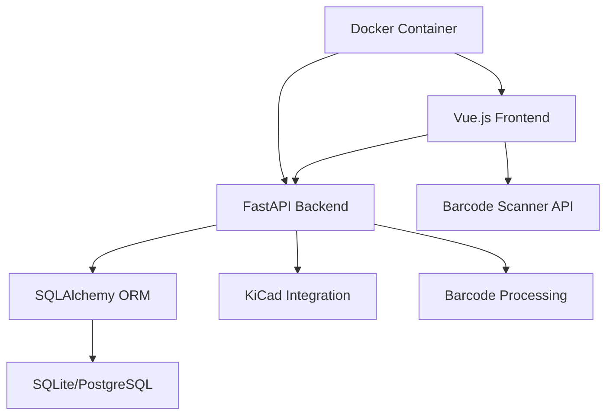

# System Architecture

PartsHub is designed with a modern, scalable architecture that supports both individual makers and larger organizations.

## Overview

PartsHub follows a **full-stack web architecture** with clear separation of concerns:

## Technology Stack

### Frontend
- **Vue.js 3** - Reactive JavaScript framework
- **Quasar Framework** - Component library and build tools
- **TypeScript** - Type-safe JavaScript development
- **Composition API** - Modern Vue.js patterns

### Backend
- **FastAPI** - Modern Python web framework
- **SQLAlchemy** - Python ORM and database toolkit
- **Alembic** - Database migration management
- **Pydantic** - Data validation and serialization

### Infrastructure
- **Docker** - Containerized deployment
- **SQLite** - Development database
- **PostgreSQL** - Production database option
- **uv** - Fast Python package management

## Detailed Architecture

### [Barcode Scanning](barcode-scanning.md)
Multi-layered barcode scanning system with progressive enhancement:
- Native browser APIs (preferred)
- JavaScript library fallbacks
- Manual input as last resort

### [KiCad Integration](kicad-integration.md)
Comprehensive EDA software integration:
- Automatic library generation
- Symbol and footprint creation
- 3D model management
- Bidirectional synchronization

## Design Principles

### 🎯 **User-Centric Design**
Every feature is designed with the end-user experience in mind, from barcode scanning to component organization.

### 🔧 **Developer-Friendly**
Clean APIs, comprehensive documentation, and modern development practices make PartsHub easy to contribute to.

### 📈 **Scalable Architecture**
From single-user setups to multi-user deployments, PartsHub scales with your needs.

### 🔒 **Security-First**
Authentication, authorization, and data protection are built into the core architecture.

### 🧪 **Test-Driven Development**
Comprehensive testing ensures reliability and maintainability across all components.

## Performance Considerations

- **Database Optimization** - Indexes and query optimization for fast searches
- **Lazy Loading** - Frontend components load as needed
- **Caching Strategies** - Intelligent caching of component data
- **Progressive Enhancement** - Features work even when advanced capabilities aren't available

## Deployment Options

### Development
- Local development with hot-reload
- In-memory SQLite database
- Separate frontend and backend servers

### Production
- Docker containerized deployment
- PostgreSQL database
- Nginx reverse proxy
- SSL/TLS termination

---

!!! tip "Architecture Deep Dive"

    For detailed technical information:

    - [Barcode Scanning Architecture](barcode-scanning.md)
    - [KiCad Integration Architecture](kicad-integration.md)
    - [Backend API Documentation](../backend/)
    - [Frontend Development Guide](../frontend/)