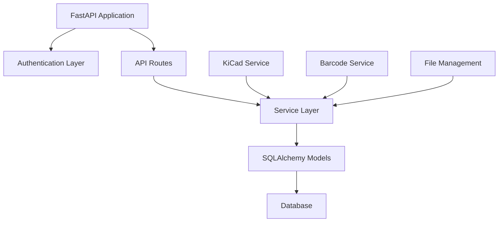

# Backend Documentation

The PartsHub backend is built with **FastAPI** and provides a robust, scalable API for managing electronic parts inventory.

## Architecture Overview



## Key Components

### API Framework
- **FastAPI** - Modern, fast web framework with automatic OpenAPI documentation
- **Pydantic** - Data validation and serialization
- **SQLAlchemy** - Database ORM with relationship management
- **Alembic** - Database migration management

### Authentication & Security
- **JWT Tokens** - Secure user authentication
- **API Keys** - Service-to-service authentication
- **Role-based Access** - Admin and user permissions
- **CORS** - Cross-origin request handling

### Database Design
- **Component Management** - Parts, specifications, and metadata
- **Storage Organization** - Hierarchical location tracking
- **Project Integration** - BOM and project component tracking
- **KiCad Data** - Symbol, footprint, and library information

## Available Documentation

### [Testing Guide](testing.md)
Comprehensive testing documentation covering:
- Test environment isolation
- Unit, contract, and integration tests
- Database safety and production separation
- Test environment configuration

### [KiCad Field Mappings](kicad-field-mappings.md)
Detailed reference for KiCad integration:
- Component data to KiCad field mapping
- Symbol and footprint generation
- Custom template configuration
- API response formats

## API Documentation

The backend provides interactive API documentation:

- **Swagger UI**: `http://localhost:8000/docs` - Interactive API explorer
- **ReDoc**: `http://localhost:8000/redoc` - Clean documentation interface

## Development Setup

### Prerequisites
- Python 3.10+
- uv package manager

### Quick Start
```bash
cd backend
uv sync
uv run alembic upgrade head
uv run python -m uvicorn src.main:app --host 0.0.0.0 --port 8000 --reload
```

See the [Getting Started Guide](../user/getting-started.md) for detailed setup instructions.

## Testing

### Running Tests
```bash
cd backend
python run_tests.py
```

### Test Categories
- **Unit Tests** (28/28 passing) - Model and business logic testing
- **Contract Tests** (135/185 passing) - API endpoint behavior testing
- **Integration Tests** - End-to-end workflow testing

See [Testing Guide](testing.md) for comprehensive testing information.

## Database Management

### Migrations
```bash
# Create a new migration
uv run alembic revision --autogenerate -m "Description"

# Apply migrations
uv run alembic upgrade head

# View migration history
uv run alembic history
```

### Models
Key database models:
- `Component` - Electronic parts and specifications
- `StorageLocation` - Hierarchical storage organization
- `Project` - Project and BOM management
- `KiCadLibraryData` - KiCad integration data

## Service Architecture

### Component Service
- Component CRUD operations
- Search and filtering
- Specification management
- Stock tracking

### Storage Service
- Location hierarchy management
- Component assignment
- Cascade delete protection

### KiCad Service
- Library generation
- Symbol and footprint creation
- Field mapping and validation
- Export functionality

### Integration Services
- Barcode processing
- File management
- External API integration

## Configuration

### Environment Variables
- `DATABASE_URL` - Database connection string
- `SECRET_KEY` - JWT token signing key
- `PORT` - Server port (default: 8000)
- `TESTING` - Test mode flag

### Production Deployment
- Docker containerization
- PostgreSQL database
- Environment-based configuration
- Health checks and monitoring

---

!!! tip "Backend Development"

    Key resources for backend development:

    - [Testing Guide](testing.md) - Essential for development workflow
    - [KiCad Integration](kicad-field-mappings.md) - Integration details
    - [API Documentation](http://localhost:8000/docs) - Interactive API explorer
    - [Architecture Overview](../architecture/) - System design context