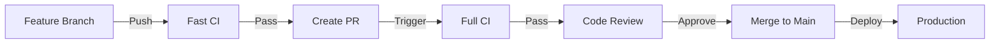

# Developer Guide

Welcome to the PartsHub developer documentation. This section contains technical guides and documentation for developers working on the PartsHub project.

## Contents

### [Workflows](workflows.md)
Complete guide to GitHub Actions workflows including:
- CI/CD pipeline overview
- Fast vs. full test execution strategies
- Deployment processes
- Release management
- Troubleshooting common workflow issues

### [Session Notes (2025-09-27)](session-notes-2025-09-27.md)
Detailed session notes from the KiCad integration fixes and frontend implementation, including:
- Technical decisions and architecture
- Implementation details for Projects and Admin pages
- API development and testing results
- Performance characteristics and security considerations

## Quick Links

- **[CLAUDE.md](../../CLAUDE.md)** - Project development guidelines and commands
- **[Backend Testing](../backend/testing.md)** - Backend testing guide
- **[Architecture Docs](../architecture/index.md)** - System architecture documentation
- **[Repository Setup](../repository-setup.md)** - Initial repository configuration

## Development Workflow Overview



### Quick Start

1. **Clone the repository**
   ```bash
   git clone https://github.com/madeinoz67/partshub.git
   cd partshub
   ```

2. **Install dependencies**
   ```bash
   make install
   ```

3. **Start development servers**
   ```bash
   make dev
   ```

4. **Run tests**
   ```bash
   make test
   ```

For detailed workflow information, see the [Workflows guide](workflows.md).
